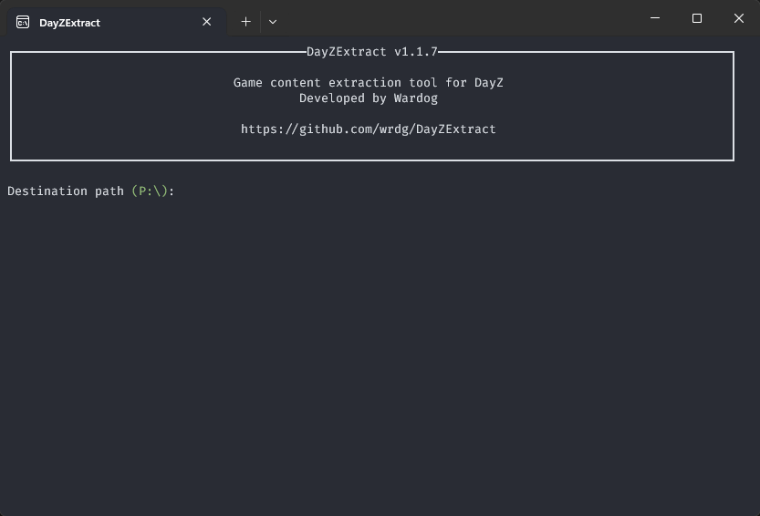

# DayZExtract

A fast alternative to DayZ Tools Extract and DayZ2P by Mikero.

Extracts and decompresses game content from DayZ PBOs with a live terminal experience.



## Features

- **Fast** parallel PBO extraction with configurable concurrency
- **Auto-detects** your DayZ installation via Steam (stable and experimental)
- **Self-updating** checks GitHub for new releases on startup
- **Rich UI** live progress bars and file breakdown chart via [Spectre.Console](https://github.com/spectreconsole/spectre.console)
- **Smart cleanup** removes stale files from previous extractions before writing new ones
- **Flexible filtering** include or exclude specific file extensions

## Installation
Download the latest installer from the [Releases](https://github.com/wrdg/DayZExtract/releases/latest) page.

The installer creates a shortcut on your desktop and in the Start Menu.

> **Note:** You can also run the `.exe` directly without installing.

> **Note:** The installer and executable are not code signed. Some antivirus software may flag them as suspicious. This is a false positive, you can verify the download against the release checksums or build from source if preferred.

## Usage

```
DayZExtract.exe [destination] [options]
```

| Argument / Option | Short | Description |
|---|---|---|
| `destination` | | Output path (defaults to `%userprofile%/dayz-extract`) |
| `--unattended` | `-u` | Skip all prompts and pauses |
| `--experimental` | `-x` | Extract the DayZ Experimental branch |
| `--game-install-path` | `-g` | Override the game installation path |
| `--include-extensions` | `-i` | Comma-separated list of extensions to include |
| `--exclude-extensions` | `-e` | Comma-separated list of extensions to exclude |
| `--parallel` | `-p` | Maximum number of PBOs to extract simultaneously |
| `--flat-scripts` | `-f` | Extract scripts without a `DayZ` subfolder per module |
| `--include-unofficial-pbos` | `-b` | Also extract PBOs without a `.dayz.bisign` signature (e.g. mods) |

### Examples

```bash
# interactive prompt for destination
DayZExtract.exe

# extract to a specific path, no prompts
DayZExtract.exe C:\dayz-files --unattended

# extract only scripts and configs
DayZExtract.exe --include-extensions *.cpp,*.hpp,*.xml,*.json,*.c

# exclude textures and materials
DayZExtract.exe --exclude-extensions *.paa,*.rvmat

# extract experimental with 8 parallel workers
DayZExtract.exe --experimental --parallel 8
```

## Unicode Support (Windows)

For spinners and progress bar characters to render correctly, enable UTF-8 system locale:

1. Run `intl.cpl`
2. Click the **Administrative** tab
3. Click **Change system locale**
4. Check **Use Unicode UTF-8 for worldwide language support**

## Building from Source

Requires [.NET 10 SDK](https://dotnet.microsoft.com/download).

```bash
# debug build
dotnet build KuruExtract.slnx

# release build (x64)
dotnet build KuruExtract.slnx -c Release

# run directly
dotnet run --project src/KuruExtract/KuruExtract.csproj -- [options]

# publish AOT single-file executable
dotnet publish KuruExtract.slnx -c Release -r win-x64
```

### Packaging with Velopack

Install the `vpk` CLI tool:

```bash
# pinned version, stable does not support MSI packages
dotnet tool install -g vpk --version 0.0.1535-gb21da2a
```

Then publish and pack:

```bash
# publish
dotnet publish KuruExtract.slnx -c Release -r win-x64

# pack app into installer
vpk pack -u DayZExtract -v 1.0.0 -o releases -p publish --mainExe DayZExtract.exe --packAuthors Wardog --msi --instLocation PerUser
```

## License

This project is licensed under the [MIT License](LICENSE).

Copyright © 2022 Wardog
